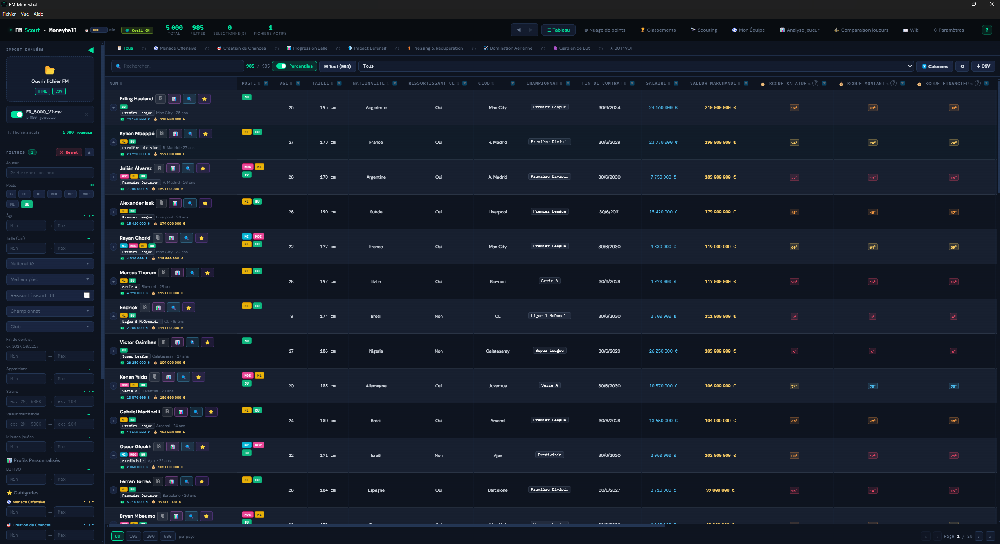
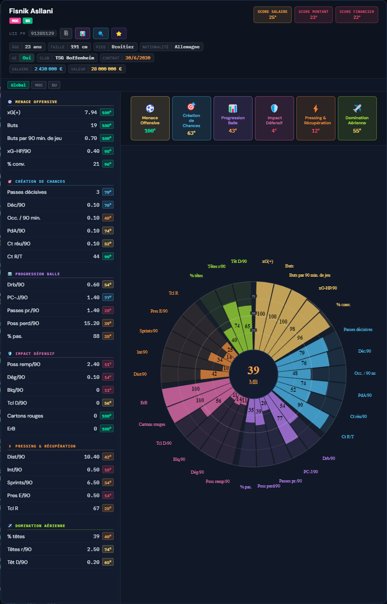

# 📋 GUIDE D'UTILISATION / USER GUIDE

Lien / Link : [https://www.transfernow.net/dl/20260316E0WKlfxD](https://www.transfernow.net/dl/20260316E0WKlfxD)

---

## 🇫🇷 SECTION FRANÇAIS

### ⚙️ Fonctionnement
Cette application analyse les fichiers d'exportation que vous lui transmettez pour traiter les données de vos joueurs. 
> **Note sur le Mapping :** Les calculs, pondérations et l'interprétation des rôles reposent sur un mapping personnel. C'est une vision propre de l'analyse de données FM qui peut différer des standards habituels.

### 💶 Précision sur les Salaires
Tous les types de salaires (annuel, mensuel, hebdomadaire) sont acceptés par l'application. Cependant, **seul le format en Euros (€) est officiellement supporté**. L'utilisation d'une autre devise (Livre, Dollar, etc.) risque de fausser les calculs et l'affichage des données financières.

### 📁 Répertoire "Exemples"
Pour vous aider à appréhender l'outil, un dossier `Exemples` est disponible. Il contient :
* **Fichiers de paramètres :** `Parametres_FM_24.json` et `Parametres_FM_26.json` (configurations prêtes à être importées).
* **Données de démonstration :** `Exemple_Data_FM_24.html` et `Exemple_Data_FM_26.csv`.
> ⚠️ **Attention :** Les fichiers de paramètres fournis sont spécifiquement configurés pour fonctionner avec les fichiers de données d'exemple correspondants. Ils peuvent ne pas être compatibles avec d'autres exports si les colonnes diffèrent.

### 📂 Installation des fichiers requis
Les fichiers nécessaires (Vues `.fmf`) se trouvent dans le dossier : `Fichiers_Application`.
Placez les fichiers de vue dans le dossier correspondant à votre version de FM :
* **Windows :** `Documents \ Sports Interactive \ Football Manager 202X \ views`
* **Mac :** `Utilisateurs \ [Nom] \ Bibliothèque \ Application Support \ Sports Interactive \ Football Manager 202X \ views`

#### 1. Football Manager 2024 (Format HTML)
* **Fichier de vue :** `Vue_Export_FM24.fmf`
* **Procédure :** Appliquez la vue dans votre effectif, faites **Contrôle + P**, et choisissez l'export en **Fichier HTML**.

#### 2. Football Manager 2026 (Format CSV)
* **Fichier de vue :** `Vue_Export_FM26.fmf`
* **Configuration :** Nécessite **BepInEx** et une DLL ([Lien FMScout](https://www.fmscout.com/a-fm26-player-csv-export.html)).
* **Procédure :** Utilisez la DLL pour générer votre fichier CSV via la vue sélectionnée.

### 🛡️ Sécurité (Exécutable .exe)
Un avertissement Windows peut apparaître. C'est **normal** (absence de signature numérique). Cliquez sur "Informations complémentaires" puis "Exécuter quand même". Ce programme ne contient aucun code malveillant et ne consulte que les fichiers que vous lui transmettez.

---

## 🇬🇧 ENGLISH SECTION

### ⚙️ Overview
This application analyzes the export files you provide to process your player data.
> **About Mapping:** The calculations, weightings, and role interpretations are based on a personal mapping. This reflects a custom FM data analysis methodology.

### 💶 Currency & Wage Notes
All wage types (yearly, monthly, weekly) are compatible with the application. However, **only the Euro (€) format is officially supported**. Using other currencies (Pounds, Dollars, etc.) may lead to incorrect calculations and financial data display.

### 📁 "Exemples" Directory
To help you get started, an `Exemples` folder is available. It contains:
* **Settings Files:** `Parametres_FM_24.json` and `Parametres_FM_26.json` (ready-to-import configurations).
* **Demo Data:** `Exemple_Data_FM_24.html` and `Exemple_Data_FM_26.csv`.
> ⚠️ **Warning:** The provided settings files are specifically configured to work with the included demo data files. They may not be compatible with other exports if columns differ.

### 📂 Required Files Installation
The necessary files (Views `.fmf`) are located in the folder: `Fichiers_Application`.
Place the view files into the folder corresponding to your FM version:
* **Windows:** `Documents \ Sports Interactive \ Football Manager 202X \ views`
* **Mac:** `Users \ [Name] \ Library \ Application Support \ Sports Interactive \ Football Manager 202X \ views`

#### 1. Football Manager 2024 (HTML Format)
* **View File:** `Vue_Export_FM24.fmf`
* **Procedure:** Apply the view in your squad, press **Ctrl + P**, and choose **HTML file** export.

#### 2. Football Manager 2026 (CSV Format)
* **View File:** `Vue_Export_FM26.fmf`
* **Setup:** Requires **BepInEx** and a DLL ([FMScout Link](https://www.fmscout.com/a-fm26-player-csv-export.html)).
* **Procedure:** Use the DLL to generate your CSV file using the specified view.

### 🛡️ Security (Executable .exe)
A Windows warning may appear. This is **normal**. Click "More info" and then "Run anyway." This program contains no malicious code and only reads the files you provide.

---

## 🖼️ VISUALISATION EXAMPLES

* **Vue Tableau / Table View :** 
*Un récapitulatif clair de toutes les statistiques pour comparer les joueurs en un coup d'œil. / A clear summary of all statistics to compare players at a glance.*

---

* **Carte Joueur / Player Card :** 
*Une fiche détaillée (type "Radar Chart") pour visualiser les forces et faiblesses selon le rôle. / A detailed breakdown (Radar Chart style) to visualize strengths and weaknesses based on role.*
